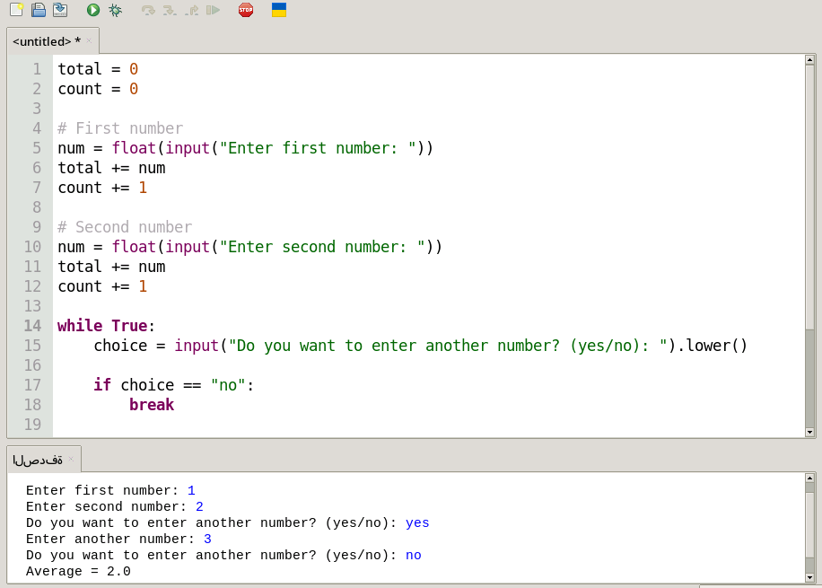

# Average Calculator

A simple Python program to calculate the average of multiple numbers entered by the user.

## Features

- Calculate the average of multiple numbers.
- Accepts unlimited user input.
- Simple command-line interface.
- Beginner-friendly Python code.

## How to Run

```bash
python average_calculator.py
```

## Example

```
Enter first number: 10
Enter second number: 20
Do you want to enter another number? (yes/no): yes
Enter another number: 30
Do you want to enter another number? (yes/no): no

Average = 20.0
```
## Screenshot


## License

MIT License
## License

MIT License
